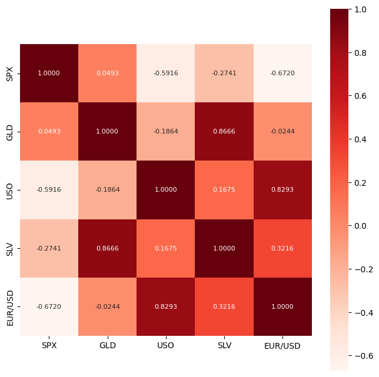
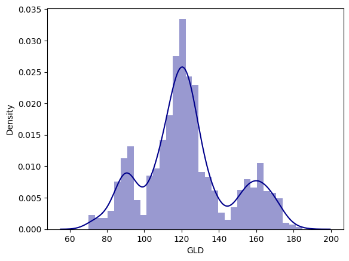
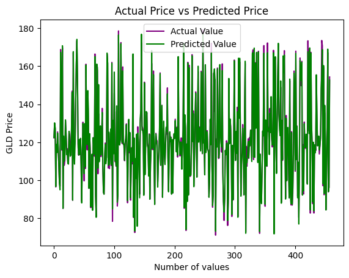

# Gold Price Prediction using a Random Forest Regressor

Elliot Willner

This project aims to predict gold prices using machine learning techniques, specifically the Random Forest Regressor, based on other assets' price data. The model achieves an R² error score of 0.99007 and an MSE of 5.44169, indicating a high level of accuracy in predicting gold prices.

## Introduction

Predicting gold prices is a valuable application in finance and commodities trading. This project utilizes the Random Forest Regressor, a machine learning algorithm, to make accurate predictions based on historical data.

## Dataset

The dataset used for this project contains historical gold prices and related financial indicators. The data is preprocessed to handle missing values and convert non-numeric data into numeric format suitable for model training. Used the Gold Price Dataset from [Kaggle](https://www.kaggle.com/datasets/altruistdelhite04/gold-price-data?resource=download).

## Data Preparation and Visualization

1. **Data Cleaning**: Removed or imputed missing values.
2. **Feature Engineering**: Selected relevant features for the model.
3. **Data Transformation**: Converted data types to ensure compatibility with the Random Forest Regressor.

Gold Price Correlation Heatmap:



Gold Price Density Plot:



## Model Training

The Random Forest Regressor was chosen due to its ability to handle large datasets and provide accurate predictions, along with its advantage over linear regression in that it can assist in prediction of nonlinear relationships. The model was trained and tested using the preprocessed data. 

```python
from sklearn.ensemble import RandomForestRegressor
from sklearn.model_selection import train_test_split
from sklearn import metrics

# Load your data into a pandas DataFrame (gold_data)

# Preprocessing steps (assuming gold_data is already preprocessed)

# Define features and target
X = gold_data.drop(['Date', 'GLD'], axis=1)
Y = gold_data['GLD']

# Split the data into training and testing sets
X_train, X_test, y_train, y_test = train_test_split(X, y, test_size=0.2, random_state=42)

# Initialize the Random Forest Regressor
regressor = RandomForestRegressor(n_estimators=64)

# Train the model
regressor.fit(X_train, y_train)

# Make predictions

# Evaluate the model
```

## Results

The model achieved an R² error score of 0.99007, indicating that it can explain approximately 99% of the variance in gold prices. Additionally, the model achieved a Mean Squared Error (MSE) of 5.44169, demonstrating its effectiveness in predicting gold prices with minimal error.




## Usage

To use this project, follow these steps:

1. Clone the repository:
```bash
git clone https://github.com/elliotwillner/gold_price_prediction
cd gold-price-prediction
```

2. Install the required dependencies:
```bash
pip install -r requirements.txt
```

3. Run and edit the notebook.


## Acknowledgements
Huge thanks to [Siddhardhan](https://www.youtube.com/@Siddhardhan/featured) for guiding me on this project.
